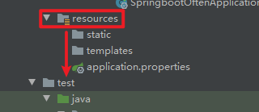

# 一、配置文件默认后缀


application.properties或application.yml

# 二、位置以及写法

## 1.位置：resources根目录下



## 2.写法

中是否有正确的配置，确保已正确定义属性“spring.kafka.bootstrap-servers”的值，例如： 在application.properties文件中： spring.kafka.bootstrap-servers=your_kafka_bootstrap_servers 在application.yml文件中： spring:  kafka:    bootstrap-servers: your_kafka_bootstrap_servers

```
在application.properties文件中：
spring.kafka.bootstrap-servers=your_kafka_bootstrap_servers


在application.yml文件中：
spring:
  kafka:
    bootstrap-servers: your_kafka_bootstrap_servers
```

