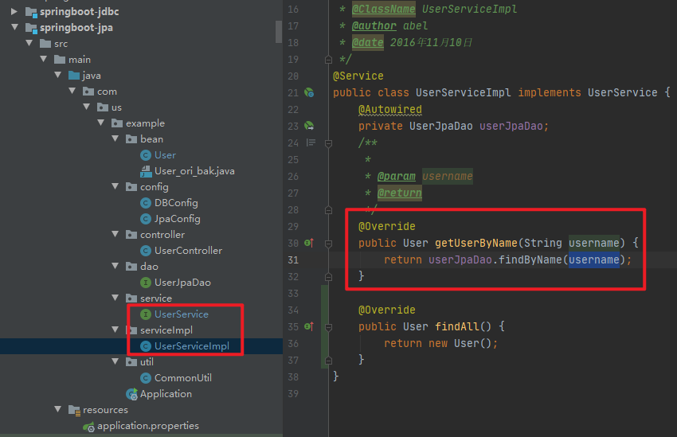
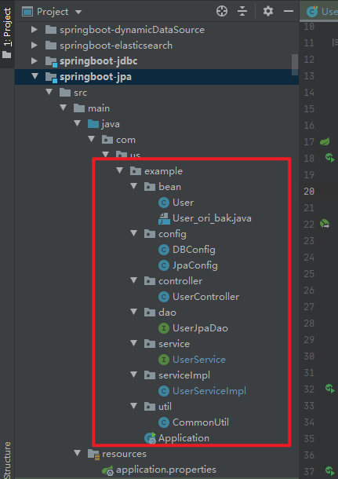
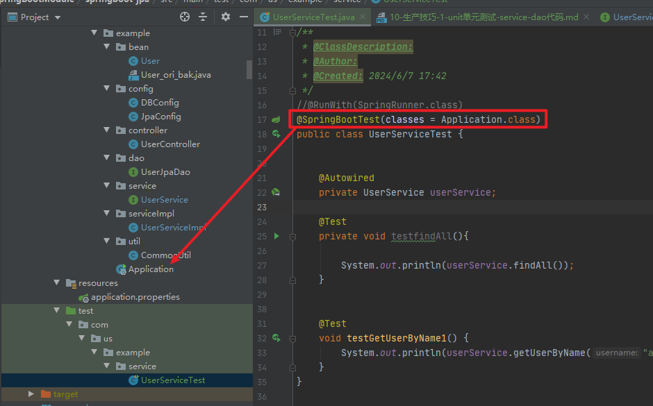
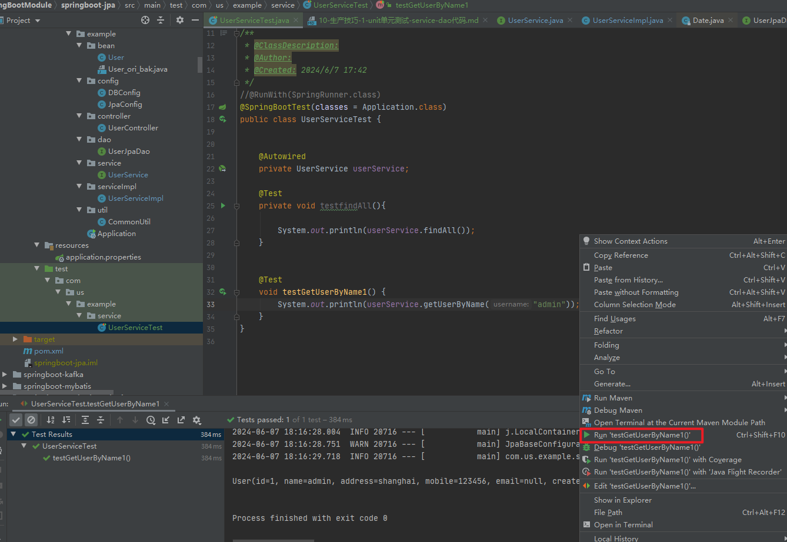
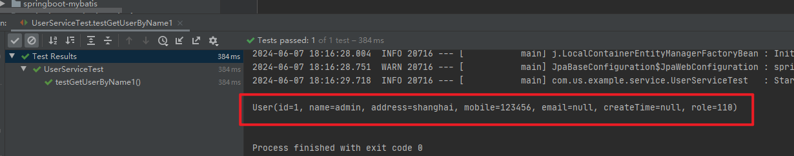
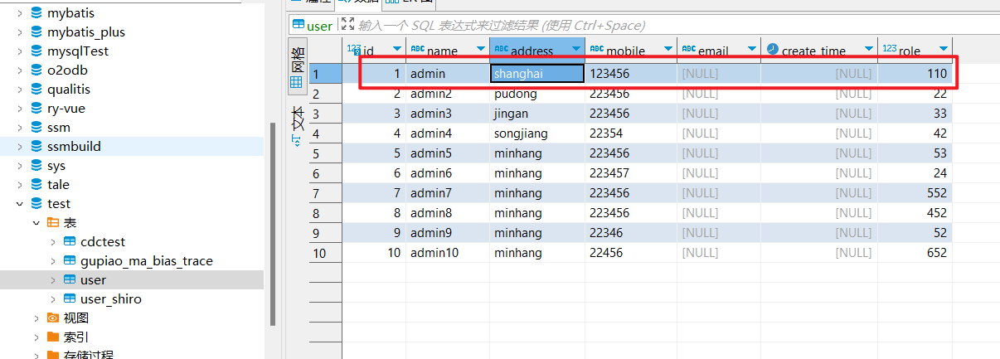
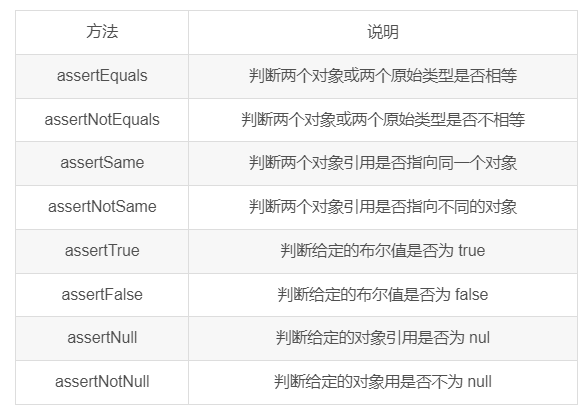

# 一、需求

springboot的一些方法，是无法直接进行测试的。那么，如何快速调试测试，就非常关键，对于我的开发。



当日亲测，可以通过单元测试实现。

## 【关联项目】

javaproject\improve\springBootModule\springboot-jpa



# Spring Boot单元测试

https://blog.csdn.net/m0_63951142/article/details/131632392

❤️❤️❤️SSM专栏更新中，各位大佬觉得写得不错，支持一下，感谢了！❤️❤️❤️

Spring + Spring MVC + MyBatis_冷兮雪的博客-CSDN博客

Spring Boot 中进行单元测试是一个常见的做法，可以帮助你验证应用程序的各个组件是否按预期工作。所以我们有必要去学习一番！

# 一、什么是单元测试？🍭

单元测试（unit testing），是指对软件中的最小可测试单元进行检查和验证的过程就叫单元测试。单元测试是开发者编写的一小段代码，用于检验被测代码的⼀个很小的、很明确的（代码）功能是否正确。执行单元测试就是为了证明某段代码的执行结果是否符合我们的预期。如果测试结果符合我们的预期，称之为测试通过，否则就是测试未通过（或者叫测试失败）。

# 二、单元测试有哪些好处？🍭

1.方便、快捷测试一个功能模块（方法级别）
2.在打包时会运行所以的单元测试，只有所有的单元测试都通过之后才能正常的打包，所以在这个过程中可以帮我们发现一些问题，减少问题的概率。
3.使用单元测试可以在不污染数据库数据的情况下，来测试某个功能的正确性。（添加@Transactional注解即可）MyBatis查询数据库（2）_冷兮雪的博客-CSDN博客

# 三、Spring Boot 单元测试使用🍭

Spring Boot 项目创建时会默认单元测试框架 spring-boot-test，而这个单元测试框架主要是依靠另⼀ 个著名的测试框架 JUnit 实现的，打开 pom.xml 就可以看到，以下信息是 Spring Boot 项目创建是自动添加的：

```xml
<dependency>
            <groupId>org.springframework.boot</groupId>
            <artifactId>spring-boot-starter-test</artifactId>
            <scope>test</scope>
</dependency>
```

而 spring-boot-starter-test 的 MANIFEST.MF（Manifest 文件是用来定义扩展或档案打包的相关信息的）里面有具体的说明，如下信息所示：


# 四、单元测试的实现步骤🍭

## 1.生成单元测试类🍉

在需要进行单元测试的类里面右键：


 UserMapperTest生成在text目录下：


```java
package com.example.ssmdemo1.mapper;
 
import org.junit.jupiter.api.Test;
 
import static org.junit.jupiter.api.Assertions.*;
 
class UserMapperTest {
 
    @Test
    void getUserById() {
    }
}
```


这个时候，此方法是不能调用到任何单元测试的方法的，此类只生成了单元测试的框架类，具体的业务代码要自己填充。

## 2、添加单元测试代码🍉

### Ⅰ、添加 Spring Boot 框架测试注解：@SpringBootTest🍓

```java
package com.example.ssmdemo1.mapper;
 
import org.junit.jupiter.api.Test;
import org.springframework.boot.test.context.SpringBootTest;
 
import static org.junit.jupiter.api.Assertions.*;
 
@SpringBootTest//表明当前单元测试是运行在Spring Boot环境中的
class UserMapperTest {
 
    @Test
    void getUserById() {
    }
}
```

#### 【实际操作】




### Ⅱ、添加单元测试业务逻辑🍓

```java
package com.example.ssmdemo1.mapper;
 
import com.example.ssmdemo1.entity.Userinfo;
import org.junit.jupiter.api.Test;
import org.springframework.beans.factory.annotation.Autowired;
import org.springframework.boot.test.context.SpringBootTest;
 
import static org.junit.jupiter.api.Assertions.*;
 
@SpringBootTest//1、表明当前单元测试是运行在Spring Boot环境中的
class UserMapperTest {
    //2、注入测试对象
    @Autowired
    private UserMapper userMapper;
 
    @Test
    void getUserById() {
        //3、添加单元测试的业务代码
        Userinfo userinfo=userMapper.getUserById(1);
        System.out.println(userinfo);
    }
}
```

启动测试项目：


我们进行单元测试， 后面需要去运行我们的项目，我们一定要将右上角重新切换过来：


## 3.【实际操作：运行test方法】



结果：是符合数据库中的数据的。





# 五、简单的断言说明🍭



方法	说明
assertEquals	判断两个对象或两个原始类型是否相等
assertNotEquals	判断两个对象或两个原始类型是否不相等
assertSame	判断两个对象引用是否指向同一个对象
assertNotSame	判断两个对象引用是否指向不同的对象
assertTrue	判断给定的布尔值是否为 true
assertFalse	判断给定的布尔值是否为 false
assertNull	判断给定的对象引用是否为 nul
assertNotNull	判断给定的对象用是否不为 null
断言：如果断言失败，则后面的代码都不会执行。

```java
package com.example.ssmdemo1.mapper;
 
import com.example.ssmdemo1.entity.Userinfo;
import org.junit.jupiter.api.Assertions;
import org.junit.jupiter.api.Test;
import org.springframework.beans.factory.annotation.Autowired;
import org.springframework.boot.test.context.SpringBootTest;
 
import static org.junit.jupiter.api.Assertions.*;
 
@SpringBootTest//1、表明当前单元测试是运行在Spring Boot环境中的
class UserMapperTest {
    //2、注入测试对象
    @Autowired
    private UserMapper userMapper;
 
    @Test
    void getUserById() {
        //3、添加单元测试的业务代码
        Userinfo userinfo=userMapper.getUserById(1);
        System.out.println(userinfo);
        //判断1是否等于2 简单断言
        Assertions.assertEquals(1,2);
    }
}
```

 单元测试失败：


单元测试失败，这时候我们去打包也会打包失败：


 打包失败：


 打包成功：


————————————————

                            版权声明：本文为博主原创文章，遵循 CC 4.0 BY-SA 版权协议，转载请附上原文出处链接和本声明。

原文链接：https://blog.csdn.net/m0_63951142/article/details/131632392


