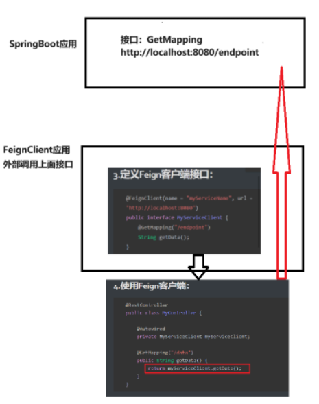

# springboot的实例FeignClient

在Spring Boot中使用FeignClient时，首先需要添加依赖，然后定义接口并使用`@FeignClient`注解标注。以下是一个简单的例子：

## 1.添加依赖到`pom.xml`：

```
		<!-- spring cloud open feign -->
		<dependency>
			<groupId>org.springframework.cloud</groupId>
			<artifactId>spring-cloud-starter-openfeign</artifactId>
			<version>3.1.1</version>
		</dependency>
```

## 2.启用Feign客户端：

在Spring Boot应用的主类或配置类上添加`@EnableFeignClients`注解。

```
@SpringBootApplication
@EnableFeignClients
public class MyApplication {
    public static void main(String[] args) {
        SpringApplication.run(MyApplication.class, args);
    }
}
```

## 3.定义Feign客户端接口：

```java
@FeignClient(name = "myServiceName", url = "http://localhost:8080")
public interface MyServiceClient {
    @GetMapping("/endpoint")
    String getData();
}
```

## 4.使用Feign客户端：

```java
@RestController
public class MyController {
 
    @Autowired
    private MyServiceClient myServiceClient;
 
    @GetMapping("/data")
    public String getData() {
        return myServiceClient.getData();
    }
}
```

在这个例子中，`MyServiceClient`是一个Feign客户端接口，用于定义对外部服务的请求。`@FeignClient`注解指定了服务名称和基础URL。`MyController`中注入了`MyServiceClient`，并在其方法中调用获取数据的方法。


