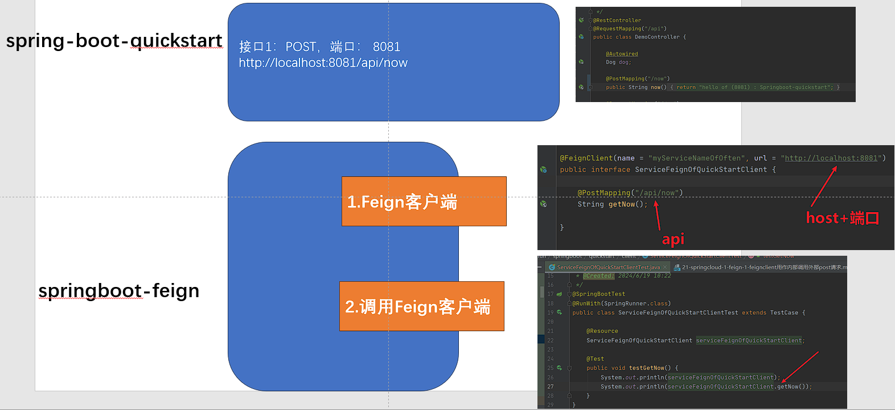

# 一、框架见ppt

21-springcloud-1-feign-3-【本地搭建】feign调用其他springboot的实例-框架.ppt


# 二、实现代码

## 1.项目：外部接口项目springboot-quickstart

接口：

```java
package com.rhwayfun.springboot.quickstart.web;

import com.rhwayfun.springboot.quickstart.pojo.Dog;
import org.springframework.beans.factory.annotation.Autowired;
import org.springframework.web.bind.annotation.PostMapping;
import org.springframework.web.bind.annotation.RequestBody;
import org.springframework.web.bind.annotation.RequestMapping;
import org.springframework.web.bind.annotation.RestController;

/**
 * Created by chubin on 2017/9/10.
 */
@RestController
@RequestMapping("/api")
public class DemoController {

    @Autowired
    Dog dog;

    @PostMapping("/now")
    public String now(){
        return "hello of (8081) : Springboot-quickstart";
    }

    @RequestMapping("/dog")
    public String dog(){
        return dog.toString();
    }

    @PostMapping("/create")
    public Dog createUser(@RequestBody Dog dogReq) {
        // ... 创建用户信息的逻辑
        return dogReq;
    }

}

```

## 目标接口：/api/now


## 2.项目：feign项目，调用外部/api/now

### （1）pom

```xml
<dependency>
    <groupId>org.springframework.cloud</groupId>
    <artifactId>spring-cloud-starter-openfeign</artifactId>
    <version>3.1.5</version>
</dependency>
```

springcloud需要2.7以上


### （2）启用Feign客户端

我们需要在启动类上添加@EnableFeignClients注解，启用Feign客户端。

```java
package com.rhwayfun.springboot.quickstart;

import org.springframework.boot.SpringApplication;
import org.springframework.boot.autoconfigure.SpringBootApplication;
import org.springframework.cloud.openfeign.EnableFeignClients;

@SpringBootApplication
@EnableFeignClients
//@ComponentScan(basePackages = {"c"})
public class Application {

	public static void main(String[] args) {
		SpringApplication.run(Application.class, args);
	}
}

```

### 

### （3）定义Feign客户端接口（关键）

@FeignClient注解里面的url指定需要请求的URL地址，name指定客户端的名称。

```java
package com.rhwayfun.springboot.quickstart.client;

import org.springframework.cloud.openfeign.FeignClient;
import org.springframework.web.bind.annotation.GetMapping;
import org.springframework.web.bind.annotation.PostMapping;

@FeignClient(name = "myServiceNameOfOften", url = "http://localhost:8081")
public interface ServiceFeignOfQuickStartClient {

    @PostMapping("/api/now")
    String getNow();

}
```


### （4）定义目标控制层（当然可以）


### （5）直接测试test测试当前方法即可

```java
package com.rhwayfun.springboot.quickstart.client;

import junit.framework.TestCase;
import org.junit.Test;
import org.junit.runner.RunWith;
import org.springframework.beans.factory.annotation.Autowired;
import org.springframework.boot.test.context.SpringBootTest;
import org.springframework.test.context.junit4.SpringRunner;

import javax.annotation.Resource;

/**
 * @ClassDescription:
 * @Author:
 * @Created: 2024/6/19 10:22
 */
@SpringBootTest
@RunWith(SpringRunner.class)
public class ServiceFeignOfQuickStartClientTest extends TestCase {

    @Resource
    ServiceFeignOfQuickStartClient serviceFeignOfQuickStartClient;

    @Test
    public void testGetNow() {
        System.out.println(serviceFeignOfQuickStartClient);
        System.out.println(serviceFeignOfQuickStartClient.getNow());
    }
}
```

执行后可以

```
HardCodedTarget(type=ServiceFeignOfQuickStartClient, name=myServiceNameOfOften, url=http://localhost:8081)
hello of (8081) : Springboot-quickstart


```

