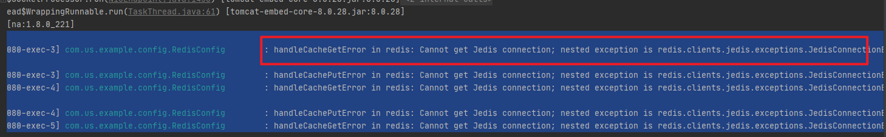
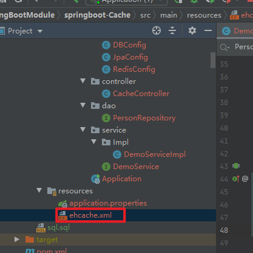
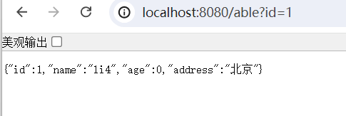

# 一、实现功能


cache实现缓存，实际是通过redis实现的。所以，如果redis不启动就会无法缓存。


# 二、关键点

## 1.application.properties: mysql配置和redis配置

```
ms.db.driverClassName=com.mysql.jdbc.Driver
ms.db.url=jdbc:mysql://192.168.136.100:3306/test?prepStmtCacheSize=517&cachePrepStmts=true&autoReconnect=true&useUnicode=true&characterEncoding=utf-8&useSSL=false&allowMultiQueries=true
ms.db.username=root
ms.db.password=123456
ms.db.maxActive=500
#最多缓存 500 条 ，缓存在 30 分钟后失效
#spring.cache.guava.spec= maximumSize=500,expireAfterWrite=30m
#redis.hostname=xxxxxx

redis.hostname=192.168.136.100
redis.port=6379
```

## 2.mysql建表

```sql
CREATE TABLE `person` (
  `id` int(11) NOT NULL AUTO_INCREMENT,
  `name` varchar(100) DEFAULT NULL,
  `age` int(11) DEFAULT NULL,
  `address` varchar(200) DEFAULT NULL,
  PRIMARY KEY (`id`)
) ENGINE=InnoDB AUTO_INCREMENT=101 DEFAULT CHARSET=utf8;
```


## 3.redis必须有，因为这个cache就是底层是redis实现。没有无法缓存。



```

2024-07-02 16:08:03.446  WARN 7056 --- [nio-8080-exec-3] com.us.example.config.RedisConfig        : handleCacheGetError in redis: Cannot get Jedis connection; nested exception is redis.clients.jedis.exceptions.JedisConnectionException: Could not get a resource from the pool
为id、key为:1数据做了缓存
2024-07-02 16:08:05.483  WARN 7056 --- [nio-8080-exec-3] com.us.example.config.RedisConfig        : handleCachePutError in redis: Cannot get Jedis connection; nested exception is redis.clients.jedis.exceptions.JedisConnectionException: Could not get a resource from the pool
2024-07-02 16:08:38.310  WARN 7056 --- [nio-8080-exec-4] com.us.example.config.RedisConfig        : handleCacheGetError in redis: Cannot get Jedis connection; nested exception is redis.clients.jedis.exceptions.JedisConnectionException: Could not get a resource from the pool
为id、key为:1数据做了缓存
2024-07-02 16:08:40.335  WARN 7056 --- [nio-8080-exec-4] com.us.example.config.RedisConfig        : handleCachePutError in redis: Cannot get Jedis connection; nested exception is redis.clients.jedis.exceptions.JedisConnectionException: Could not get a resource from the pool
2024-07-02 16:08:47.605  WARN 7056 --- [nio-8080-exec-5] com.us.example.config.RedisConfig        : handleCacheGetError in redis: Cannot get Jedis connection; nested exception is redis.clients.jedis.exceptions.JedisConnectionException: Could not get a resource from the pool

```


## 4.ehcache.xml 好像没什么用，没有也能运行。




# 三、执行验证

## 1.执行接口：除了第一次比较慢，后续会很快

http://localhost:8080/able?id=1



