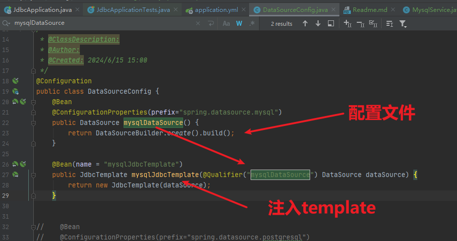
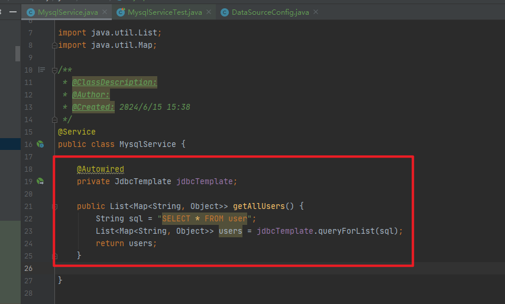
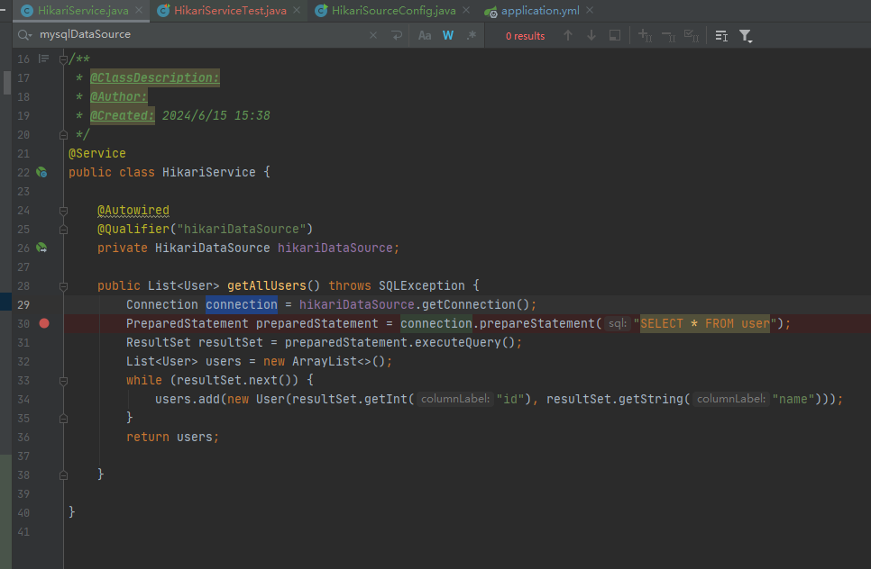

# 一、常见报错

## 1.[java.lang.IllegalArgumentException: jdbcUrl is required with driverClassName.](https://www.cnblogs.com/hellokitty1/p/12174950.html)

百度翻译就是：driverClassName需要jdbcUrl

在配置文件中的


 改成：


就可以了。

spring.datasource.url 数据库的 JDBC URL。

spring.datasource.jdbc-url 用来创建连接的 JDBC URL。

官方文档的解释是：

因为连接池的实际类型没有被公开，所以在您的自定义数据源的元数据中没有生成密钥，而且在IDE中没有完成(因为DataSource接口没有暴露属性)。另外，如果您碰巧在类路径上有Hikari，那么这个基本设置就不起作用了，因为Hikari没有url属性(但是确实有一个jdbcUrl属性)。


# 二、springboot的jdbc结构

## 1.DataSourceConfig配置

### application.yml

```
spring:
  datasource:
    mysql:
      username: root
      password: 123456
      #mysql5.8���ϣ�����ʱ������������һ��ʱ�����ã�serverTimezone=UTC
      jdbc-url: jdbc:mysql://192.168.136.100:3306/test?userUnicode=true?characterEncodeing=utf-8
      driver-class-name: com.mysql.jdbc.Driver
```

### DataSourceConfig类

```sql
package com.ray.jdbc.config;

import org.springframework.beans.factory.annotation.Qualifier;
import org.springframework.boot.context.properties.ConfigurationProperties;
import org.springframework.boot.jdbc.DataSourceBuilder;
import org.springframework.context.annotation.Bean;
import org.springframework.context.annotation.Configuration;
import org.springframework.jdbc.core.JdbcTemplate;

import javax.sql.DataSource;


/**
 * @ClassDescription:
 * @Author:
 * @Created: 2024/6/15 15:00
 */
@Configuration
public class DataSourceConfig {
    @Bean
    @ConfigurationProperties(prefix="spring.datasource.mysql")
    public DataSource mysqlDataSource() {
        return DataSourceBuilder.create().build();
    }

    @Bean(name = "mysqlJdbcTemplate")
    public JdbcTemplate mysqlJdbcTemplate(@Qualifier("mysqlDataSource") DataSource dataSource) {
        return new JdbcTemplate(dataSource);
    }


}

```




## 2.Service操作sql：可以直接查询

```java
package com.ray.jdbc.service;

import org.springframework.beans.factory.annotation.Autowired;
import org.springframework.jdbc.core.JdbcTemplate;
import org.springframework.stereotype.Service;

import java.util.List;
import java.util.Map;

/**
 * @ClassDescription:
 * @Author:
 * @Created: 2024/6/15 15:38
 */
@Service
public class MysqlService {

    @Autowired
    private JdbcTemplate jdbcTemplate;

    public List<Map<String, Object>> getAllUsers() {
        String sql = "SELECT * FROM user";
        List<Map<String, Object>> users = jdbcTemplate.queryForList(sql);
        return users;
    }

}

```





## 3.关键点：Autowired和Qualifier指定bean

md_springboot_知识点\01-基本注解-2-Autowired和Qualifier多个bean时，指定对应Bean.md


# 三、springboot的链接数据库

## 1.mysql

## 2.postgresql

已经添加

## 3.jdbcTemplate实现增上改查

jdbcTemplate是Spring提供的用于简化数据库操作的类库。以下是使用jdbcTemplate实现增删改查的示例：

1. 添加数据：

```
jdbcTemplate.update("INSERT INTO my_table (id, name, age) VALUES (?, ?, ?)", id, name, age);
```

2. 查询数据：

```
List<Map<String, Object>> result = jdbcTemplate.queryForList("SELECT * FROM my_table");
```

3. 更新数据：

```
jdbcTemplate.update("UPDATE my_table SET name = ?, age = ? WHERE id = ?", name, age, id);
```

4. 删除数据：

```
jdbcTemplate.update("DELETE FROM my_table WHERE id = ?", id);
```

其中，`update`方法用于执行更新操作，`queryForList`方法用于执行查询操作。在SQL语句中可以使用问号占位符`?`，然后在执行方法时指定实际参数。

# 四、数据库连接池HikariConfig

## 1.配置yml以及代码

```ymal
    hikari:
      minimumIdle: 5
      maximum-pool-size: 30
      idle-timeout: 60000
      maxLifetime: 60000
      pool-name: MyHikariCP
      connection-init-sql: SELECT 1 FROM DUAL
```

代码实现

```java
package com.ray.jdbc.config;

import com.zaxxer.hikari.HikariConfig;
import com.zaxxer.hikari.HikariDataSource;
import lombok.extern.slf4j.Slf4j;
import org.springframework.beans.factory.annotation.Autowired;
import org.springframework.boot.SpringApplication;
import org.springframework.context.annotation.Bean;
import org.springframework.context.annotation.Configuration;

import javax.sql.DataSource;

@Slf4j
@Configuration
public class HikariSourceConfig {


    private Integer maximumPoolSize = 50;
    private Integer minimumIdle = 1;
    private Integer keepaliveTime = 60000;
    private Integer connectionTimeout = 60000;

//    @Bean
    public HikariConfig dataSource() {
        //对应数据库链接
        HikariConfig  config = new HikariConfig();
        config.setJdbcUrl("jdbc:mysql://192.168.136.100:3306/test?userUnicode=true?characterEncodeing=utf-8");
        config.setUsername("root");
        config.setPassword("123456");
        config.setDriverClassName("com.mysql.jdbc.Driver");

        //设置连接池参数
        config.setMinimumIdle(minimumIdle); //最小连接数
        config.setMaximumPoolSize(maximumPoolSize);  //最大连接
        config.setConnectionTimeout(keepaliveTime); //保持时间
        config.setIdleTimeout(connectionTimeout); //过时时间
        config.setMaxLifetime(1800000);

        return config;
    }

    @Bean(name = "hikariDataSource")
    public HikariDataSource hikariDataSource() {
        HikariDataSource hikariDataSource = null;
        try {
            hikariDataSource = new HikariDataSource(dataSource());
        } catch (Exception ex) {
            log.error("create hikariDataSource failed--->", ex);
        }
        return hikariDataSource;
    }

    public static void main(String[] args) {
        SpringApplication.run(HikariSourceConfig.class, args);
    }
}
```

## 2.Service查询结果



```java
package com.ray.jdbc.service;

import com.ray.jdbc.entity.User;
import com.zaxxer.hikari.HikariDataSource;
import org.springframework.beans.factory.annotation.Autowired;
import org.springframework.beans.factory.annotation.Qualifier;
import org.springframework.stereotype.Service;

import java.sql.Connection;
import java.sql.PreparedStatement;
import java.sql.ResultSet;
import java.sql.SQLException;
import java.util.ArrayList;
import java.util.List;

/**
 * @ClassDescription:
 * @Author:
 * @Created: 2024/6/15 15:38
 */
@Service
public class HikariService {

    @Autowired
    @Qualifier("hikariDataSource")
    private HikariDataSource hikariDataSource;

    public List<User> getAllUsers() throws SQLException {
        Connection connection = hikariDataSource.getConnection();
        PreparedStatement preparedStatement = connection.prepareStatement("SELECT * FROM user");
        ResultSet resultSet = preparedStatement.executeQuery();
        List<User> users = new ArrayList<>();
        while (resultSet.next()) {
            users.add(new User(resultSet.getInt("id"), resultSet.getString("name")));
        }
        return users;

    }

}

```

