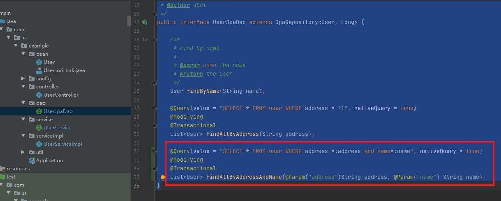

# 一、实现功能

## 1.jpa实现通过sql去实现一个查询功能

### （1）DAO层添加


```java
package com.us.example.dao;

import org.springframework.data.jpa.repository.JpaRepository;

import com.us.example.bean.User;
import org.springframework.data.jpa.repository.Modifying;
import org.springframework.data.jpa.repository.Query;

import javax.transaction.Transactional;
import java.util.List;

/**
 * The Interface UserJpaDao.
 * @author abel
 */
public interface UserJpaDao extends JpaRepository<User, Long> {

    /**
     * Find by name.
     *
     * @param name the name
     * @return the user
     */
    User findByName(String name);

    @Query(value = "SELECT * FROM user WHERE address = ?1", nativeQuery = true)
    @Modifying
    @Transactional
    List<User> findAllByAddress(String address);

}
```

### （2）Service层实现逻辑

#### UserService

```java
package com.us.example.service;

import java.util.List;
import java.util.Map;

import com.us.example.bean.User;
import org.springframework.data.jpa.repository.Modifying;
import org.springframework.data.jpa.repository.Query;

import javax.transaction.Transactional;

/**
 * The Interface UserService.
 */
public interface UserService {

	/**
	 * Gets the user by name.
	 *
	 * @param username the user name
	 * @return the user by name
	 */
	public User getUserByName(String username);
	
	public List<User> findAll();

	public List<User> findAllByAddress(String address);
}

```

#### UserServiceImpl

```java
package com.us.example.serviceImpl;

import java.util.Date;
import java.util.List;
import java.util.Map;

import org.springframework.beans.factory.annotation.Autowired;
import org.springframework.stereotype.Service;

import com.us.example.dao.UserJpaDao;
import com.us.example.bean.User;
import com.us.example.service.UserService;

/**
 * 
 * @ClassName UserServiceImpl
 * @author abel
 * @date 2016年11月10日
 */
@Service
public class UserServiceImpl implements UserService {
	@Autowired
	private UserJpaDao userJpaDao;
	/**
	 * 
	 * @param username
	 * @return
	 */
	@Override
	public User getUserByName(String username) {
		return userJpaDao.findByName(username);
	}

	@Override
	public List<User> findAll() {
		return userJpaDao.findAll();
	}

	@Override
	public List<User> findAllByAddress(String address) {
		return userJpaDao.findAllByAddress(address);
	}
}


```


### （3）单元测试实现

```java
[User(id=5, name=admin5, address=minhang, mobile=223456, email=null, createTime=null, role=53), User(id=6, name=admin6, address=minhang, mobile=223457, email=null, createTime=null, role=24), User(id=7, name=admin7, address=minhang, mobile=223456, email=null, createTime=null, role=552), User(id=8, name=admin8, address=minhang, mobile=223456, email=null, createTime=null, role=452), User(id=9, name=admin9, address=minhang, mobile=22346, email=null, createTime=null, role=52), User(id=10, name=admin10, address=minhang, mobile=22456, email=null, createTime=null, role=652)]

```

符合数据库中数据


## 2.直观的方式传参：参数无序

参考：https://blog.csdn.net/malachi95/article/details/53538287


在上面的操作方式中参数传递都是以一种有序的方式传递的，另外还有一种更为直观的方式来传递参数，下面举个例子说明：

在接口`IUserService`中添加方法：

```java
@Query("UPDATE User u SET u.email= :email WHERE u.userName = :user")
@Modifying
@Transactional
void updateEmail(@Param("user") String userName, @Param("email") String email);
```

### （1）DAO层添加



```java
package com.us.example.dao;

import org.springframework.data.jpa.repository.JpaRepository;

import com.us.example.bean.User;
import org.springframework.data.jpa.repository.Modifying;
import org.springframework.data.jpa.repository.Query;
import org.springframework.data.repository.query.Param;

import javax.transaction.Transactional;
import java.util.List;

/**
 * The Interface UserJpaDao.
 * @author abel
 */
public interface UserJpaDao extends JpaRepository<User, Long> {

    /**
     * Find by name.
     *
     * @param name the name
     * @return the user
     */
    User findByName(String name);

    @Query(value = "SELECT * FROM user WHERE address = ?1", nativeQuery = true)
    @Modifying
    @Transactional
    List<User> findAllByAddress(String address);

    @Query(value = "SELECT * FROM user WHERE address =:address and name=:name", nativeQuery = true)
    @Modifying
    @Transactional
    List<User> findAllByAddressAndName(@Param("address")String address, @Param("name") String name);
}
```


### （2）Service添加

UserService

```java
package com.us.example.service;

import java.util.List;
import java.util.Map;

import com.us.example.bean.User;
import org.springframework.data.jpa.repository.Modifying;
import org.springframework.data.jpa.repository.Query;

import javax.transaction.Transactional;

/**
 * The Interface UserService.
 */
public interface UserService {

	/**
	 * Gets the user by name.
	 *
	 * @param username the user name
	 * @return the user by name
	 */
	public User getUserByName(String username);
	
	public List<User> findAll();

	public List<User> findAllByAddress(String address);

	/**
	 * 无序传参
	 * @param address
	 * @return
	 */
	public List<User> findAllByAddressAndName(String address,String name);
}

```


UserServiceImpl

```java
package com.us.example.serviceImpl;

import java.util.Date;
import java.util.List;
import java.util.Map;

import org.springframework.beans.factory.annotation.Autowired;
import org.springframework.stereotype.Service;

import com.us.example.dao.UserJpaDao;
import com.us.example.bean.User;
import com.us.example.service.UserService;

/**
 * 
 * @ClassName UserServiceImpl
 * @author abel
 * @date 2016年11月10日
 */
@Service
public class UserServiceImpl implements UserService {
	@Autowired
	private UserJpaDao userJpaDao;
	/**
	 * 
	 * @param username
	 * @return
	 */
	@Override
	public User getUserByName(String username) {
		return userJpaDao.findByName(username);
	}

	@Override
	public List<User> findAll() {
		return userJpaDao.findAll();
	}

	@Override
	public List<User> findAllByAddress(String address) {
		return userJpaDao.findAllByAddress(address);
	}

	@Override
	public List<User> findAllByAddressAndName(String address, String name) {
		return userJpaDao.findAllByAddressAndName(address,name);
	}
}

```


### （3）单元测试实现

```
[User(id=6, name=admin6, address=minhang, mobile=223457, email=null, createTime=null, role=24)]
```

符合数据库中数据。


