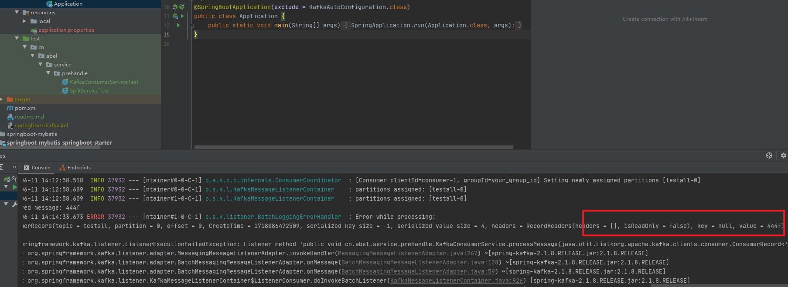
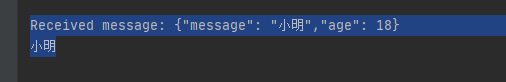

# 一、环境启动

kafka使用javabase中kafka使用docker启动即可。

..\cdh\kafka\00-docker安装kafka环境-使用命令.md


# 二、运行

## 1.kafka生产者提交消息

444f

## 2.应用可以消费到对应消息

```
ConsumerRecord(topic = testall, partition = 0, offset = 0, CreateTime = 1718086472509, serialized key size = -1, serialized value size = 4, headers = RecordHeaders(headers = [], isReadOnly = false), key = null, value = 444f)

```




## 3.报错：是因为消息，不是json格式的。

### （1）重新发送json格式消息

```
{"message": "小明","age": 18}
```

### （2）程序获取消息



```
Received message: {"message": "小明","age": 18}
小明
```

