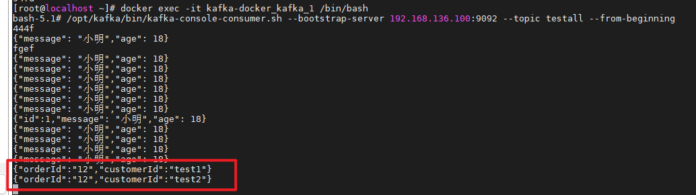

# 一、环境启动

kafka使用javabase中kafka使用docker启动即可。

..\cdh\kafka\00-docker安装kafka环境-使用命令.md


# 二、运行

## 1.kafka生产者提交消息

444f

## 2.应用可以消费到对应消息

```
ConsumerRecord(topic = testall, partition = 0, offset = 0, CreateTime = 1718086472509, serialized key size = -1, serialized value size = 4, headers = RecordHeaders(headers = [], isReadOnly = false), key = null, value = 444f)

```


## 3.报错：是因为消息，不是json格式的。

### （1）重新发送json格式消息

```
{"message": "小明","age": 18}
```

### （2）程序获取消息


```
Received message: {"message": "小明","age": 18}
小明
```


## 4.spring-kafka 出现Could not autowire. No beans of 'KafkaTemplate 

https://blog.csdn.net/suject/article/details/80845443解决：使用resource注释


# 三、kafka发送消息Springboot

## 1.kafka配置

```java
package cn.abel.config;

import org.apache.kafka.clients.producer.ProducerConfig;
import org.apache.kafka.common.serialization.StringSerializer;
import org.springframework.beans.factory.annotation.Value;
import org.springframework.context.annotation.Bean;
import org.springframework.context.annotation.Configuration;
import org.springframework.kafka.annotation.EnableKafka;
import org.springframework.kafka.core.DefaultKafkaProducerFactory;
import org.springframework.kafka.core.KafkaTemplate;
import org.springframework.kafka.core.ProducerFactory;
import org.springframework.kafka.support.serializer.JsonSerializer;

import java.util.HashMap;
import java.util.Map;

@Configuration
@EnableKafka
public class KafkaProducerConfig {

    @Value("${spring.kafka.bootstrap-servers}")
    private String bootstrapServers;

    @Bean
    public ProducerFactory<String, Object> producerFactory() {
        Map<String, Object> configs = new HashMap<>();
        configs.put(ProducerConfig.BOOTSTRAP_SERVERS_CONFIG, bootstrapServers);
        configs.put(ProducerConfig.KEY_SERIALIZER_CLASS_CONFIG, StringSerializer.class);
        configs.put(ProducerConfig.VALUE_SERIALIZER_CLASS_CONFIG, JsonSerializer.class);
        return new DefaultKafkaProducerFactory<>(configs);
    }

    @Bean(name = "kafkaTemplate")
    public KafkaTemplate<String, Object> kafkaTemplate() {
        return new KafkaTemplate<>(producerFactory());
    }

}
```


## 2.kafkafa发送者

```java
package cn.abel.service.prehandle;

import cn.abel.message.OrderMessage;
import org.springframework.beans.factory.annotation.Autowired;
import org.springframework.beans.factory.annotation.Qualifier;
import org.springframework.beans.factory.annotation.Value;
import org.springframework.kafka.core.KafkaTemplate;
import org.springframework.stereotype.Service;

@Service
public class KafkaProducerService {

    @Value("${log.statistical.kafka.topic}")
    private String topic;

    @Autowired
    @Qualifier("kafkaTemplate")
    private final KafkaTemplate<String, Object> kafkaTemplate;

    public KafkaProducerService(KafkaTemplate<String, Object> kafkaTemplate) {
        this.kafkaTemplate = kafkaTemplate;
    }

    public void sendMessage( OrderMessage orderMessage) {
        kafkaTemplate.send(topic, orderMessage.getOrderId(), orderMessage);
    }

}
```

## 3.Test测试

```java
package cn.abel.service.prehandle;

import cn.abel.message.OrderMessage;
import junit.framework.TestCase;
import org.junit.Test;
import org.junit.runner.RunWith;
import org.springframework.beans.factory.annotation.Autowired;
import org.springframework.boot.test.context.SpringBootTest;
import org.springframework.test.context.junit4.SpringRunner;
import sun.plugin2.message.Message;
import sun.plugin2.message.Serializer;

import java.io.IOException;

/**
 * @ClassDescription:
 * @Author:
 * @Created: 2024/6/15 22:12
 */
@SpringBootTest
@RunWith(SpringRunner.class)
public class KafkaProducerServiceTest extends TestCase {

    @Autowired
    KafkaProducerService kafkaProducerService;


    @Test
    public void testSendMessage() {
        kafkaProducerService.sendMessage(new OrderMessage("12","test2"));
    }
}
```


