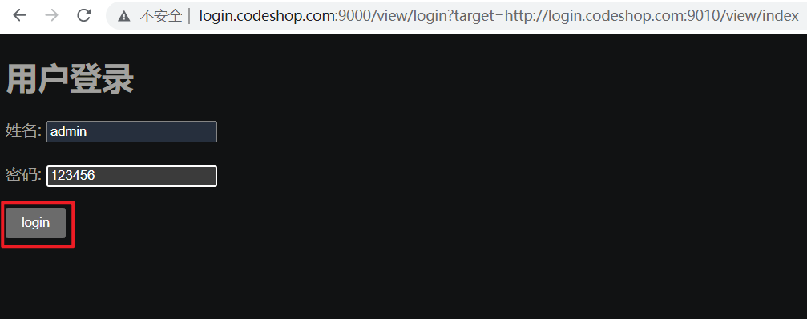

# 零、基本配置

host文件配置IP映射
注意:中间是tab键

127.0.0.1       www.codeshop.com
127.0.0.1       vip.codeshop.com
127.0.0.1       cart.codeshop.com
127.0.0.1       login.codeshop.com

启动项目,浏览器打输入一下地址,测试单点登录功能


三个模块的url：

```sh
http://www.codeshop.com:9010/view/index
http://vip.codeshop.com:9011/view/index
http://cart.codeshop.com:9012/view/index
```

登录页面的url：

login.codeshop.com:9010/view/index


# 一、相关视频

[手把手教：Java 编写SSO单点登录](https://www.bilibili.com/video/BV1Gb411T7uq?p=2&vd_source=4e17174efa20fc7411da8fda5b0e9faf)

重点：

## 1.cookie实现原理：浏览器会将本地cookie的顶级domain域名下：jd.com的相关cookie发送给服务器

当访问passport.jd.com的网站的时候，浏览器会将本地cookie的domain域名下：jd.com的相关cookie发送给服务器。这个是通过cookie实现SSO的一个基本前提。


## 2.通过cookie实现sso原理2：登录系统通过SSO系统实现登录后，跳转回原系统。同时，SSO向原系统发送一个cookie，保留能够认证用户是否登录的一些数据。而这个cookie可以被所有子系统相互访问（即同一个主domin下）


## 3.整个执行流程图


# 二、总结


cookie是用来在客户端存储数据的工具。

在其中一个子系统登录，跳转到登陆系统，登陆系统完成登录。完成登陆后，向发起登录请求的子系统写入一个cookie，保存用于认证用户是否登录的信息（例如token），其他子系统都是可以访问到这个cookie的。在其他子系统向服务器发起请求的时候，携带这个cookie完成登录。

cookie的域是需要所有子系统相同的域，这样所有子系统才能访问到这个cookie。


# 三、验证SSO实现流程

## 1.登录任意一个系统

```
http://www.codeshop.com:9010/view/index		[ok]
http://vip.codeshop.com:9011/view/index  	[ok]
http://cart.codeshop.com:9012/view/index	[ok]
```

选择点击：login


### 跳转到login页面，点击就会进入



## 2.显示登录成功

http://login.codeshop.com:9010/view/index


## 3.其他系统登录

### vip系统：http://vip.codeshop.com:9011/view/index 


### cart系统：http://cart.codeshop.com:9012/view/index


## 4.退出登录：logout


成功返回初始vip界面

